# 🛒 Flutter E-Commerce Application

A complete **Flutter-based E-Commerce mobile application** supporting **Customers, Shop Owners, and Admins**.  
The system includes product management, cart & checkout, online payment integration (test mode), and role-based dashboards using **Firebase**.

## 📱 Screenshots

All application screenshots are available inside the **`/Screenshot`** folder.

Included screens:
- Admin Dashboard
- Manage Categories
- Manage Products
- Store List
- Orders Management
- Users List
- Login & Registration
- Product Listing
- Product Details
- Cart & Checkout
- Online Payment (bKash, Nagad, SSLCommerz)
- Order Details
- Purchase History
- Customer Profile
- Shop Owner Dashboard
- Shop Settings
- Add Product
- Shop Owner Products
- Shop Orders

---

## User Roles & Features

### Customer
- Browse products by category
- View product details
- Add products to cart
- Buy Now option
- Checkout with:
  - Cash on Delivery
  - Online Payment (Test Mode)
- View order history
- Track order status
- Manage profile

---

### Shop Owner
- Automatic shop creation if not exists
- Update shop settings (name, description, banner)
- Add and manage products
- View shop-specific orders
- Dashboard with quick action tiles

---

### Admin
- Admin dashboard overview
- Manage:
  - Products
  - Categories
  - Stores
  - Customers
  - Shop owners
  - Orders
- Enable / Disable users
- Monitor platform activity

---

## 💳 Payment Integration (Test Mode)

Online payment gateways are integrated **for testing purposes only**:

- **bKash**
- **Nagad**
- **SSLCommerz**

Production credentials can be added later.

---

## Tech 

- **Frontend:** Flutter (Material UI)
- **State Management:** Provider
- **Backend:** Firebase
  - Firebase Authentication
  - Cloud Firestore
- **Image Storage:** Cloudinary
- **Payments:**
  - flutter_bkash
  - nagad_payment_gateway
  - flutter_sslcommerz

---

## 📸 Screenshots

---

### 🔐 Authentication
| Login | Register |
|:-----:|:--------:|
| 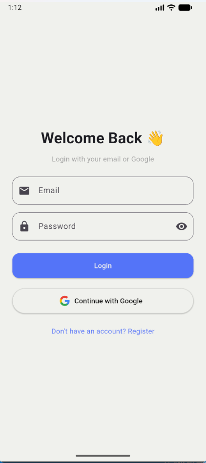 | 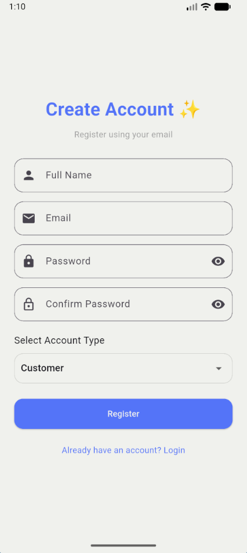 |

---

### 🏠 Onboarding
| Onboarding 1 | Onboarding 2 |
|:------------:|:------------:|
| 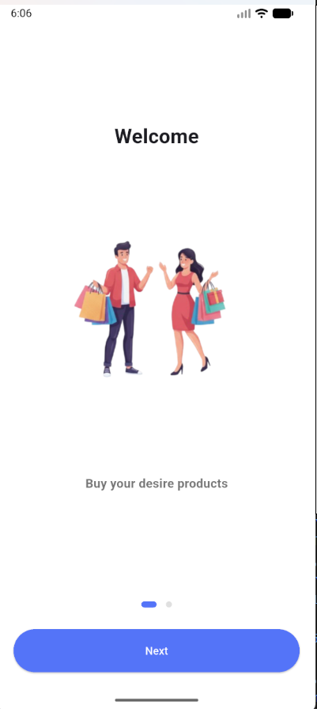 | 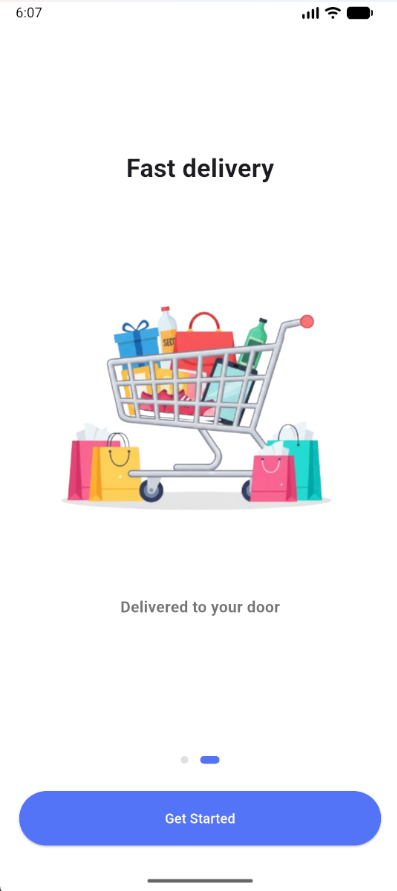 |

---

### 🛍 Customer Flow
|First Screen| All Products | Product Details |
|:------------:|:---------------:|:------------:|
| 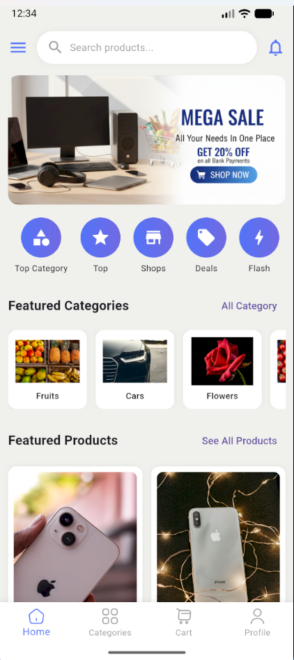| 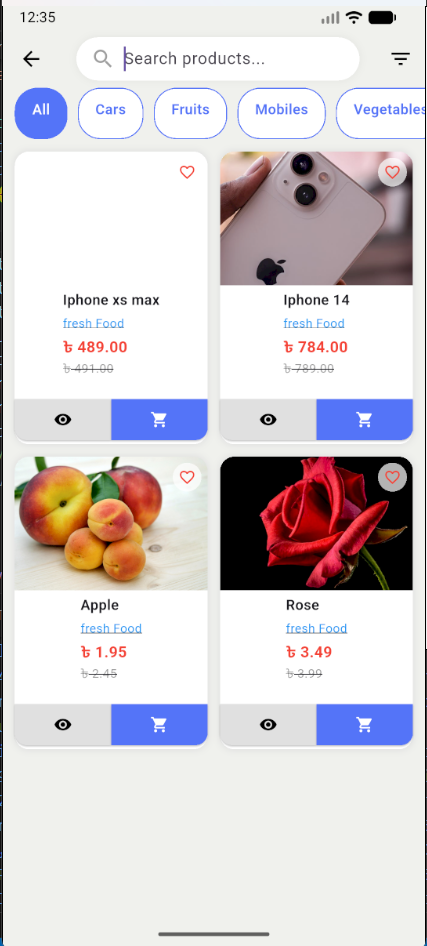 | 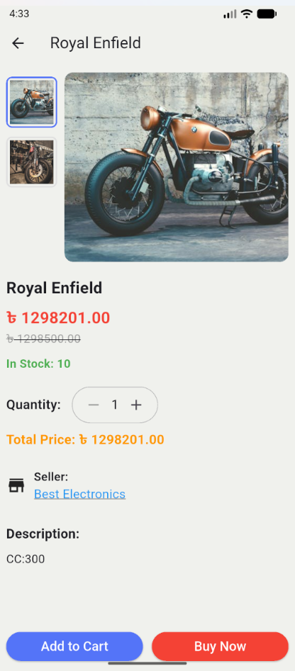 |

| Online Payment |SSLCommerce |Bkash | Order Details |
|:--------------:|:-------------:|:-------------:|
| 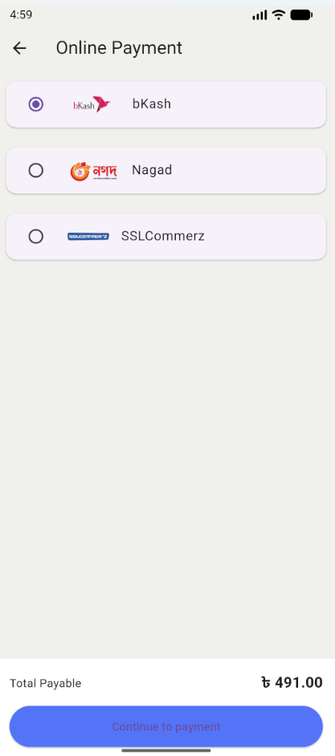 | 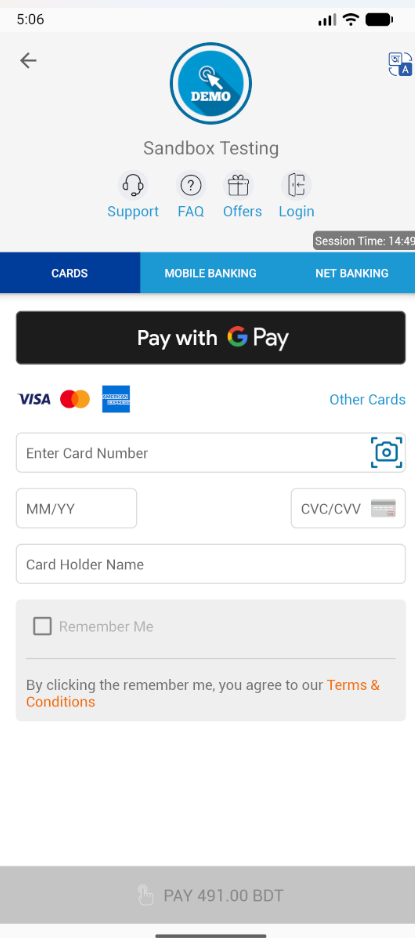|| 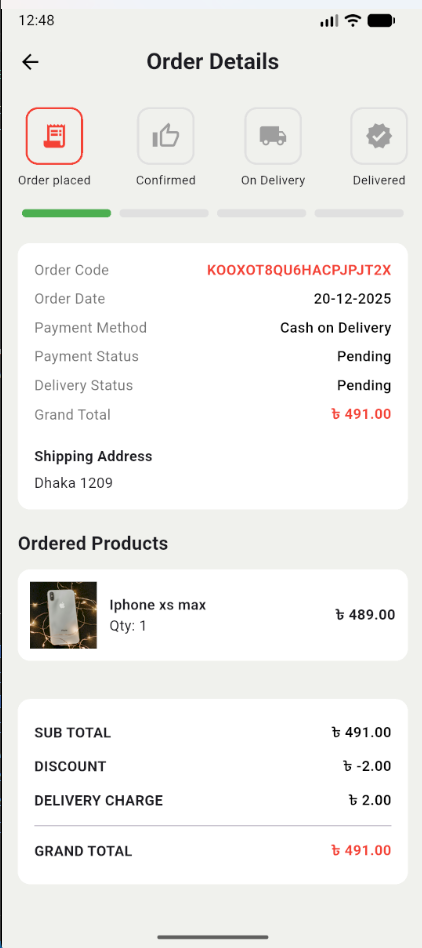 |

| Purchase History | Customer Profile |
|:----------------:|:----------------:|
|  |  |

---

### 🏪 Shop Owner
| Dashboard | Products | Settings |
|:---------:|:--------:|:--------:|
| 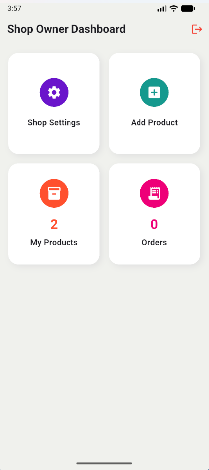 | 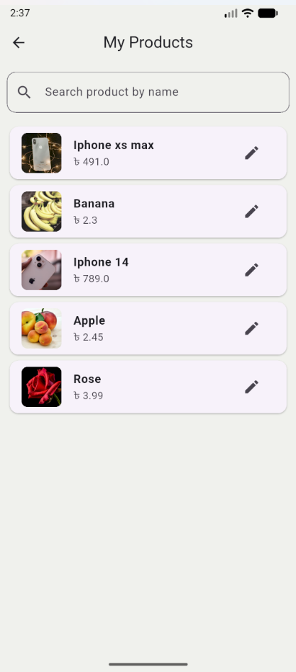 | 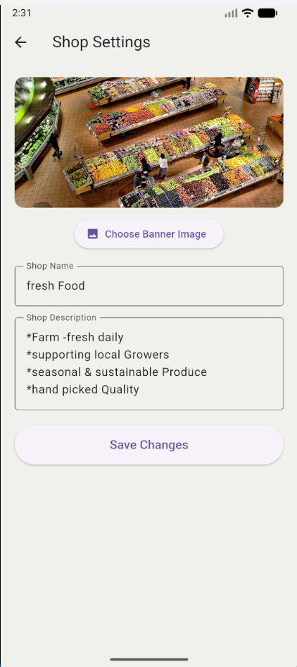 |

---

### 🛠 Admin Panel
| Dashboard | Categories |
|:---------:|:----------:|
| 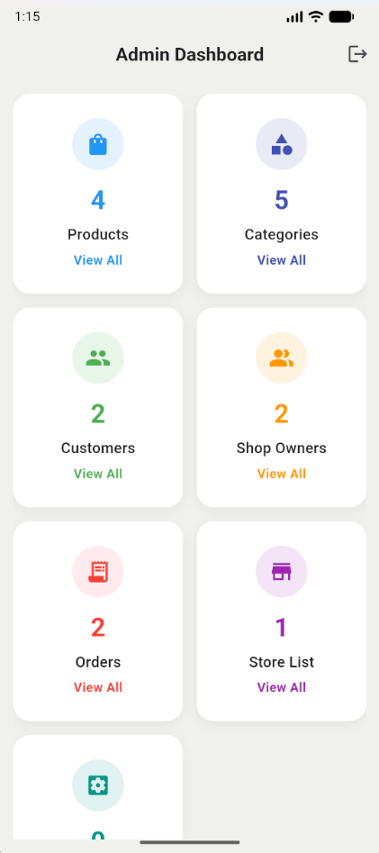 | 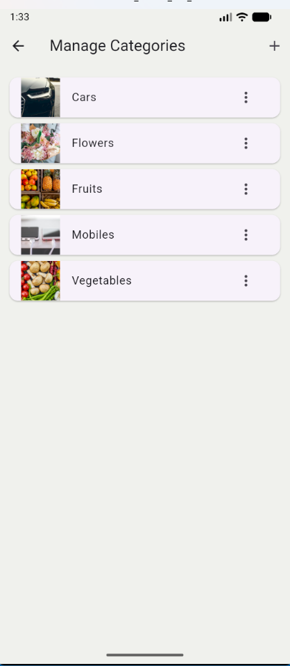 |

| Orders | Products |
|:------:|:--------:|
| 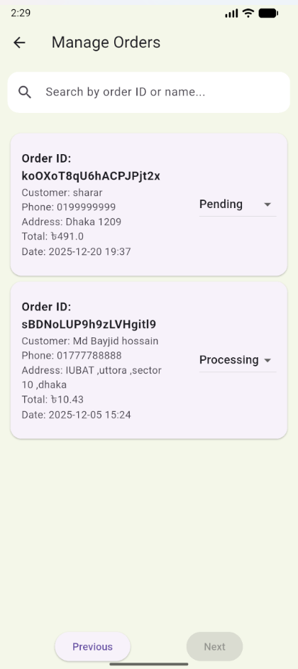 | 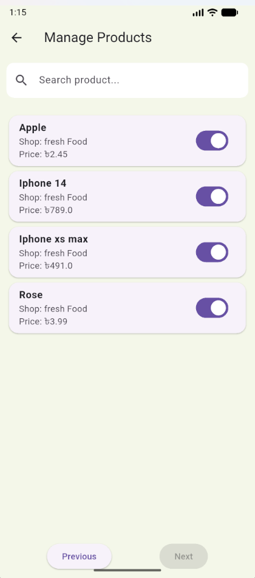 |

| Stores | Users |
|:------:|:-----:|
| 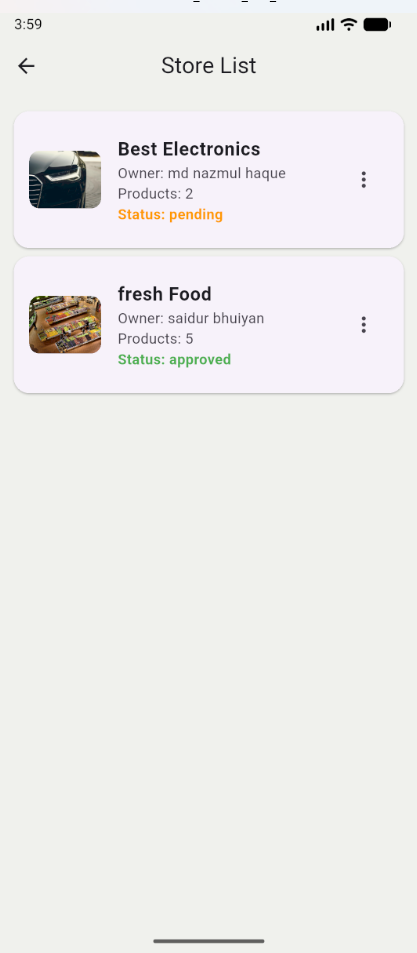 | 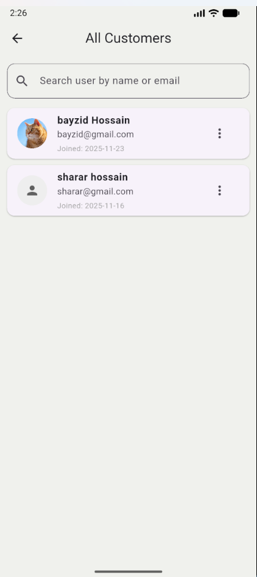 |

